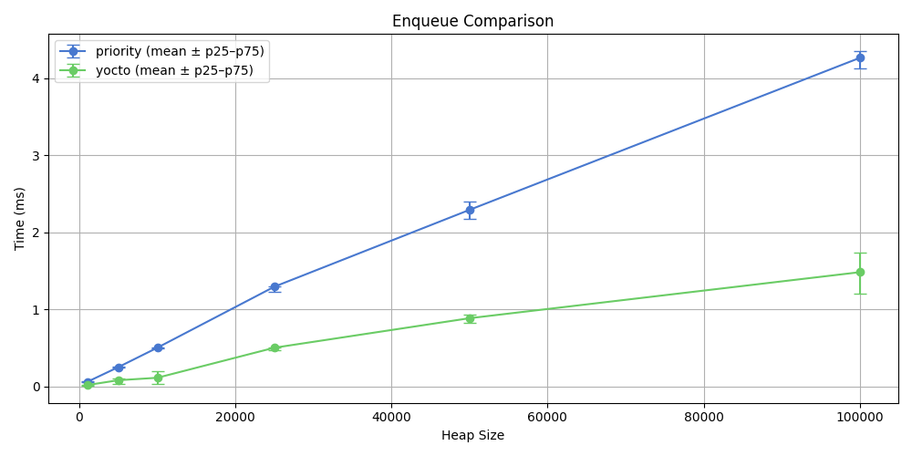
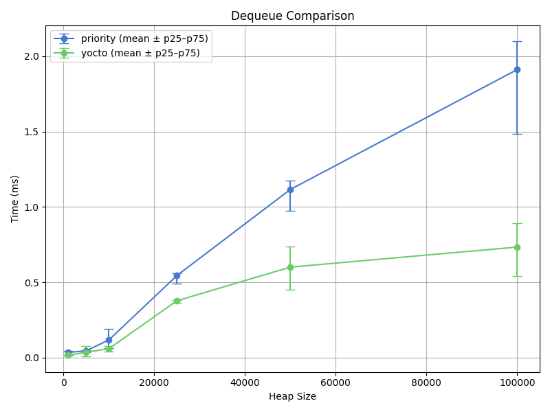
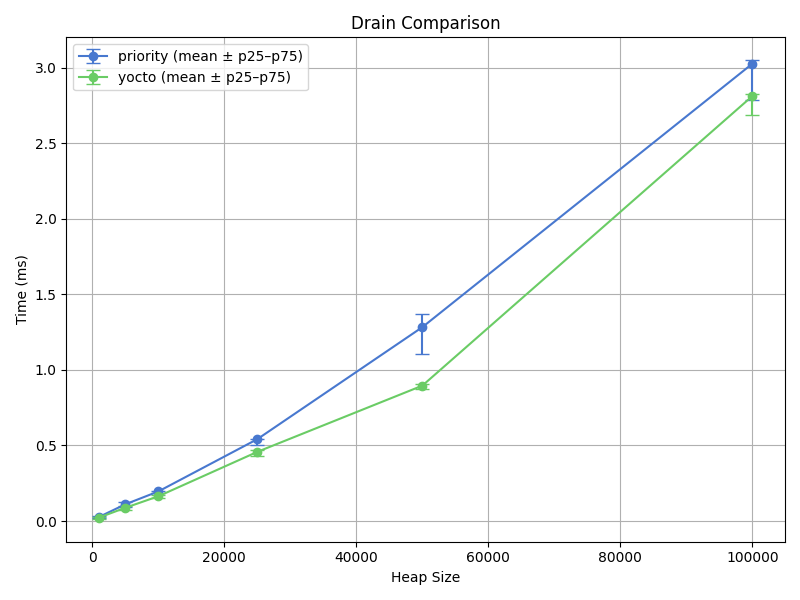
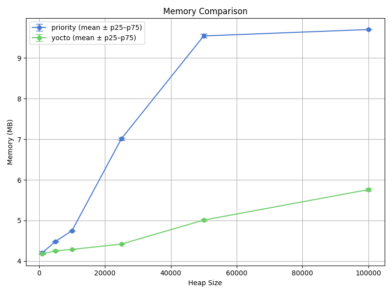

# @himenon/priority-queue

A lightweight, high-performance **priority queue** implementation in TypeScript with flexible ordering (min-heap / max-heap) and built-in iterator support.  
Designed for **performance-critical** applications and **predictable memory usage**, with behavior inspired by standard binary heap algorithms.

## ✨ Features

- ✅ **Min-heap / Max-heap switching** at runtime (`setMinHeap`, `setMaxHeap`)
- ✅ **Custom priorities** (`number`) per element
- ✅ **Stable performance** via binary heap (`O(log n)` enqueue/dequeue)
- ✅ **Iterable**: use in `for...of`, spread, etc.
- ✅ **Bulk removal** with `drain()` or sorted `drainFast()`
- ✅ **Memory-efficient**: optimized for minimal overhead
- ✅ Fully written in modern TypeScript, no dependencies

## 📦 Installation

```bash
pnpm i @himenon/priority-queue
```

## 🔧 Usage

```ts
import { PriorityQueue } from "@himenon/priority-queue";

const minQueue = new PriorityQueue<string>();
minQueue.enqueue("Wash dishes", 3);
minQueue.enqueue("Do laundry", 2);
minQueue.enqueue("Buy groceries", 1);

console.log("Min Queue Peek:", minQueue.peek()); // Output: Buy groceries
console.log("Min Queue Size:", minQueue.size); // Output: 3

console.log("Iterating (Min Queue):");
for (const task of minQueue) { // Uses the priority order iterator
  console.log(` - ${task}`); // Output: - Buy groceries, - Do laundry, - Wash dishes
}
console.log("Size after iteration:", minQueue.size); // Output: 3 (unchanged)


const maxQueue = new PriorityQueue<number>(false); // Max heap
maxQueue.enqueue(10, 10);
maxQueue.enqueue(50, 50);
maxQueue.enqueue(20, 20);

console.log("\nMax Queue Drain Fast:");
const drainedMax = maxQueue.drainFast();
console.log(drainedMax); // Output: [ 50, 20, 10 ]
console.log("Max Queue Empty:", maxQueue.isEmpty()); // Output: true
```

## 📈 Benchmark Results

The following charts compare this `PriorityQueue` implementation with [`yocto-queue`](https://github.com/sindresorhus/yocto-queue), using statistical aggregates over 10 trials. Error bars represent the 25th to 75th percentile range.

---

<div align="center">

<table>
  <tr>
    <td><strong>Enqueue Time</strong></td>
    <td><strong>Dequeue Time</strong></td>
  </tr>
  <tr>
    <td></td>
    <td></td>
  </tr>
  <tr>
    <td><strong>Drain Time</strong></td>
    <td><strong>Memory Usage</strong></td>
  </tr>
  <tr>
    <td></td>
    <td></td>
  </tr>
</table>

</div>

---

### 📌 Notes

- Benchmarks were executed **10 times per heap size**.
- All plots include **mean values** with **p25–p75 error bars**.
- Visualizations were generated via `matplotlib` in Docker.
- Raw CSV data and scripts can be found under [`benchmark/`](./benchmark/).

## ⏱️ Performance Considerations: `PriorityQueue` vs `yocto-queue`

This implementation of `PriorityQueue` adopts a binary heap internally in order to support prioritized ordering. While this introduces higher time complexity compared to plain FIFO queues like [`yocto-queue`](https://github.com/sindresorhus/yocto-queue), it is a conscious trade-off that ensures ordering guarantees while maintaining low memory footprint.

### 📊 Comparison Table

| Operation    | `yocto-queue`     | `PriorityQueue` (this) | Complexity Increase | Reason                                     |
| ------------ | ----------------- | ---------------------- | ------------------- | ------------------------------------------ |
| `enqueue`    | `O(1)`            | `O(log n)`             | Yes 🔺              | Maintains heap order via `bubbleUp`        |
| `dequeue`    | `O(1)`            | `O(log n)`             | Yes 🔺              | Requires heap reordering via `bubbleDown`  |
| `peek`       | `O(1)`            | `O(1)`                 | No ✅               | Both read front/root value                 |
| `drain`      | `O(n)`            | `O(n log n)`           | Yes 🔺              | Sequential `dequeue()` or heap sort        |
| Memory usage | Low (linked list) | **Lower** (flat array) | No ✅               | Binary heap stored as flat array (compact) |

### 🧠 Why the Priority Queue is Slower

Unlike `yocto-queue`, which is designed solely for FIFO operations and does not preserve any ordering beyond insertion time, `PriorityQueue` must always ensure that the highest or lowest priority item can be dequeued efficiently. This requires maintaining a partially ordered tree (heap), where insertion and removal involve comparisons and restructuring.

Thus, the increase in time complexity from `O(1)` to `O(log n)` is **the necessary cost of enabling**

## LICENCE

[@Himenon/priority-queue](https://github.com/Himenon/priority-queue)・MIT
