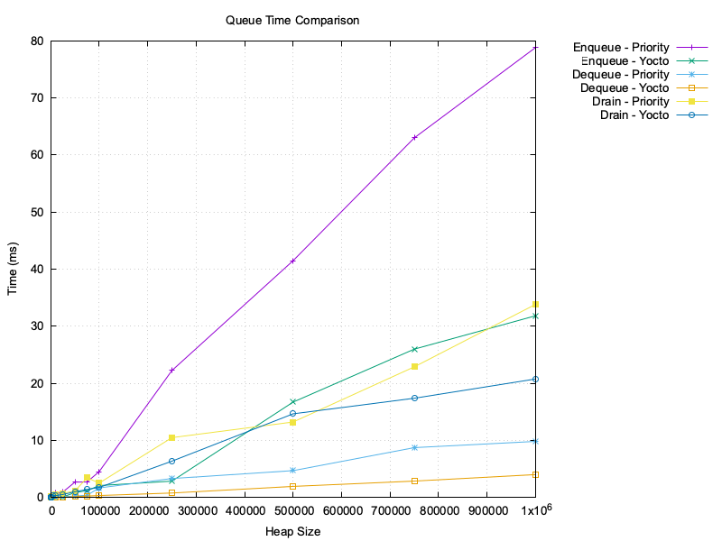

# @himenon/priority-queue

TypeScript による柔軟な優先度付きキュー実装。  
最小ヒープ／最大ヒープを **動的に切り替え可能**で、優先度順に値や関数を安全に処理できます。

## Features

- ✅ **最小／最大ヒープ切り替え**（`setMinHeap()` / `setMaxHeap()`）
- ✅ **優先度に基づく `enqueue` / `dequeue`**
- ✅ **イテレータ・サイズ取得・全要素抽出 (`drain`) 対応**
- ✅ **ジェネリクス対応（任意の型の要素を扱える）**

## Benchmark

@himenon/priority-queue (This library) vs [yocto-queue](https://github.com/sindresorhus/yocto-queue)

|                                         Time                                          |                                          Memory                                           |
| :-----------------------------------------------------------------------------------: | :---------------------------------------------------------------------------------------: |
|  |  |

## ⏱️ Performance Considerations: `PriorityQueue` vs `yocto-queue`

This implementation of `PriorityQueue` adopts a binary heap internally in order to support prioritized ordering. While this introduces higher time complexity compared to plain FIFO queues like [`yocto-queue`](https://github.com/sindresorhus/yocto-queue), it is a conscious trade-off that ensures ordering guarantees while maintaining low memory footprint.

### 📊 Comparison Table

| Operation    | `yocto-queue`       | `PriorityQueue` (this) | Complexity Increase | Reason |
|--------------|---------------------|-------------------------|----------------------|--------|
| `enqueue`    | `O(1)`              | `O(log n)`              | Yes 🔺               | Maintains heap order via `bubbleUp` |
| `dequeue`    | `O(1)`              | `O(log n)`              | Yes 🔺               | Requires heap reordering via `bubbleDown` |
| `peek`       | `O(1)`              | `O(1)`                  | No ✅                | Both read front/root value |
| `drain`      | `O(n)`              | `O(n log n)`            | Yes 🔺               | Sequential `dequeue()` or heap sort |
| Memory usage | Low (linked list)   | **Lower** (flat array)  | No ✅                | Binary heap stored as flat array (compact) |

### 🧠 Why the Priority Queue is Slower

Unlike `yocto-queue`, which is designed solely for FIFO operations and does not preserve any ordering beyond insertion time, `PriorityQueue` must always ensure that the highest or lowest priority item can be dequeued efficiently. This requires maintaining a partially ordered tree (heap), where insertion and removal involve comparisons and restructuring.

Thus, the increase in time complexity from `O(1)` to `O(log n)` is **the necessary cost of enabling**

## LICENCE

[@Himenon/priority-queue](https://github.com/Himenon/priority-queue)・MIT
